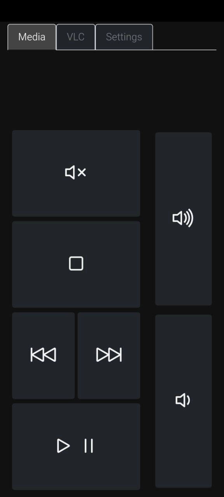
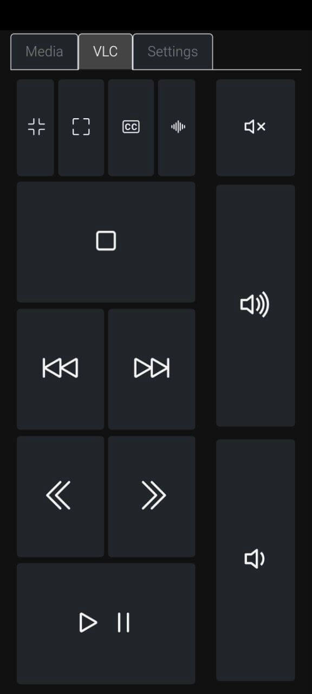
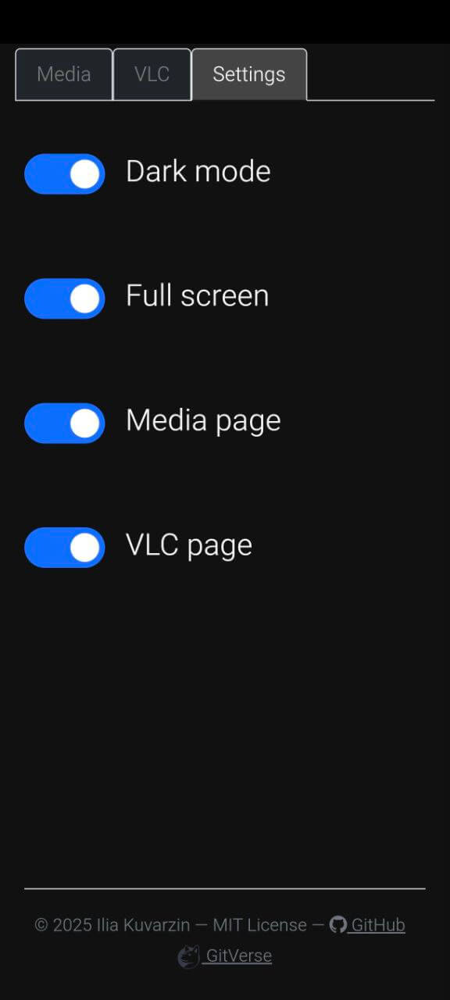

# 🎵🖥️ Remote Media Control &middot; [](./LICENSE)

## Table of Contents
- [🎵 Description](#description)
- [✨ Features](#features-✨)
- [🖼️ Screenshots](#screenshots)
- [🛠️ Installation](#installation-🛠️)
  - [🪟 Windows](#windows-🪟)
  - [🐧 Linux](#linux-🐧)
- [🎛️ Usage](#usage-🎛️)
  - [🖥️ Alternative Manual Start](#alternative-manual-start-🖥️)
- [📜 License](#license-📜)

## Description
**Remote Media Control** is an application for remotely controlling media playback on your PC. It supports Windows, Linux, and potentially macOS. Key features include:
- Media playback control using standard media keys.
- VLC mode, which uses VLC media player's hotkeys for control.

---

## Features ✨
- **Cross-Platform**: Works on Windows and Linux (macOS not tested).
- **Media Keys Mode**: Control playback using standard commands.
- **VLC Mode**: Control playback with VLC hotkeys.
- **Runs as a service**: The application can be installed and run as a system service.

---

## Screenshots

|  |  |  |
|------------------------------------------------|----------------------------------------|-----------------------------------------------|
---

## Installation 🛠️

### Windows 🪟
1. Download the latest version of the application from the [Releases](https://github.com/MatthewAllDev/remote-media-control/releases) page.
2. Extract the archive contents to a directory of your choice.
3. Run the installation script:
   ```batch
   install.bat
   ```
4. During installation, you can choose whether to launch the application at system startup.
5. To start manually, use the shortcut in the Start Menu (the application is not added to PATH).
6. To uninstall, use the shortcut in the Start Menu.

---

### Linux 🐧
1. Download the latest version of the application from the [Releases](https://github.com/MatthewAllDev/remote-media-control/releases) page.
2. Extract the archive contents to a directory of your choice.
3. Run the installation script:
   ```bash
   sudo ./setup_linux.sh install
   ```
4. During installation, you can choose whether to install the application as a service.
5. For manual start, you can use:
   - The shortcut in the applications menu.
   - The `remotemediacontrol` or `rmc` commands (symlinks are created automatically).

#### Special Commands for Linux
After installation, additional commands are available for managing the service:
- `install-service` – Install RemoteMediaControl as a systemd service.
- `enable-service` – Enable autostart at boot.
- `disable-service` – Disable autostart.
- `start-service` – Start the service.
- `stop-service` – Stop the service.
- `uninstall` – Uninstall the application.
- `help` – Show all available options.

---

## Usage 🎛️
To control media playback:
1. Open a browser on any device (your PC, smartphone, tablet, etc.).
2. Navigate to `http://<your-IP>` (port `80` is used by default).
3. Use the web interface to control media playback:
   - Standard playback commands (Play, Pause, Stop, Next, Previous).
   - VLC mode allows control using VLC hotkeys.

### Alternative Manual Start 🖥️
If you don't want to install the application as a service, you can manually start it with the following command:
```bash
remotemediacontrol --port=8080 --debug
```

When started manually, the IP address and port for connection will be displayed in the console window.

#### Command-Line Parameters
- `--port` (default: `80`): Specifies the port to run the server on.
- `--debug` (default: `false`): Enables debug mode.

Example:
```bash
remotemediacontrol --port=8080 --debug
```

Once started, the server will be accessible at `http://<your-IP>:<port>`.

---

## License 📜
This project is distributed under the MIT License. See [LICENSE](./LICENSE) for details.